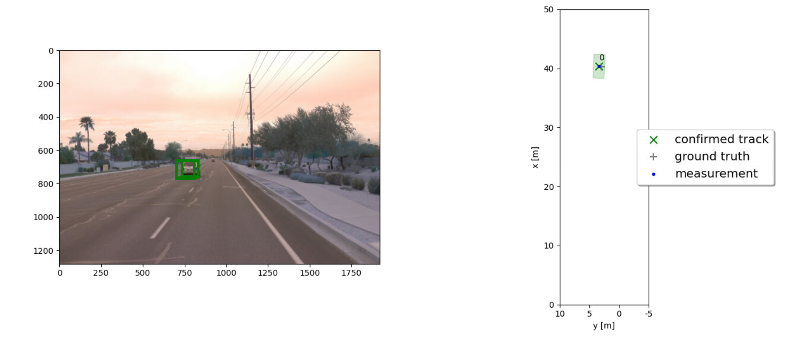
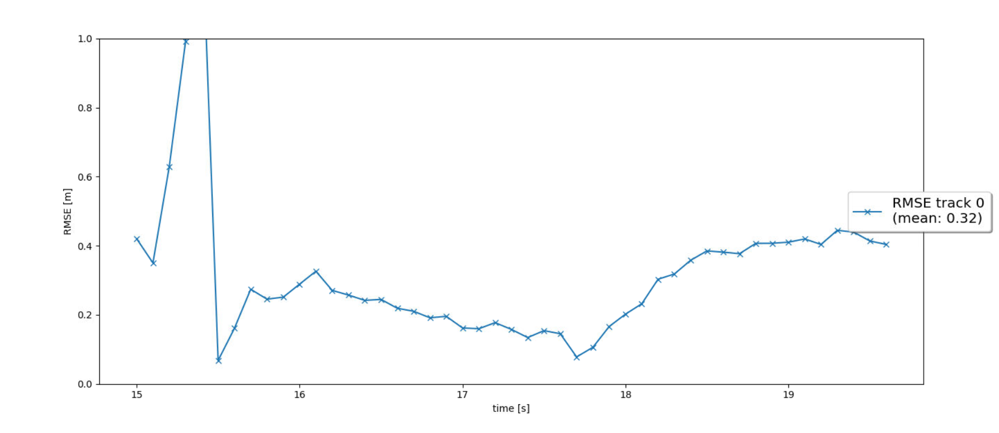
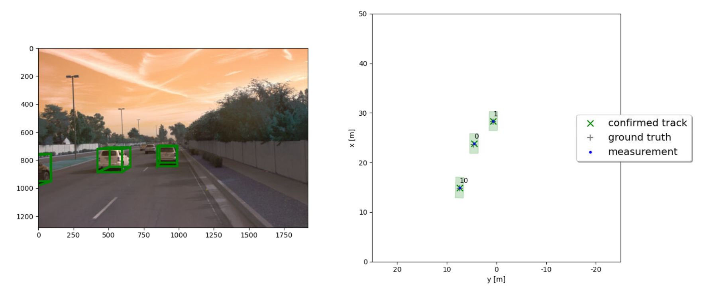
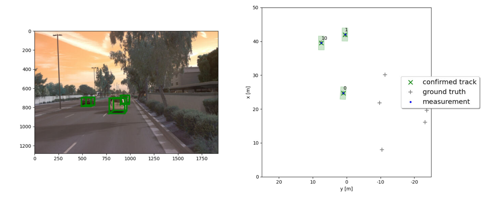
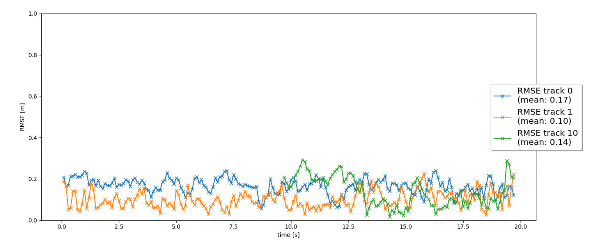

# Writeup: Sensor Fusion and Object Tracking

This is the project for the second course in the  [Udacity Self-Driving Car Engineer Nanodegree Program](https://www.udacity.com/course/c-plus-plus-nanodegree--nd213) : Sensor Fusion and Tracking. 

This final project of the second course is finished within the online-workspace VM.

The final project consists of four sections, as described in [project rubric](https://review.udacity.com/#!/rubrics/3006/view)

## Section 1: Implement an "EKF" to track a single real-world target
In this section, we a simple single-target-scenario to start, where there is only one vehicle to be tracked. 

Since the initial estimation is not well handled, the initial tracking error is relatively large.

Remark: since only lidar-data are used in this section, the extended Kalman filter is indeed equivalent to the classic Kalman filter.

## Section 2: Implement the track management, then initialize and activate it.

In this section, we deal with the track management including its initlization as well as the management of track state and track score.

## Section 3: Imlement a single nearest neighbor data association for multi-object tracking

In this step, the closest neighbor association is made to catch several different targets. 

## Section 4: implement the non-linear observation model with camera and complete the sensor fusion module for camera-lidar fusion!

The core of this course, we use different sensors (lidar and camera) to complement the pros and cons of each sensor. To end this, we first implemented a nonlinear observation model for camera, that is the reason for using extended Kalman filter. Since each sensor typically has a different field of view, we introduced function `in_fov()` to figure out if some object can be identified by a camera theretically. This is a significantly critical topic, because it is related to the state of detected object.

The final results can be obtained as follows:

1. Write a short recap of the four tracking steps and what you implemented there (filter, track management, association, camera fusion). Which results did you achieve? Which part of the project was most difficult for you to complete, and why?

- Filter
    - In the reality, the kimatic or even kinetic model of a vehicle can be very complicated, and thus using the extended Kalman filter is more rational. 
    - To pursue a more accurate numerical result, usually we may needd a higher order discretization method which leads to a larger amount of computation. Therefore a high performance mathmatical libary is needed.
    - Reason for introudcing extended kalman filter is that the while noises will be distorted under a non-linear model. However, the extended Kalman filter also brings about the error. Probably, unscented Kalman Filter could be a better choice.    

- track management 
  - A very critical part. We must initialze the new tracks with thoughtful data container.
  - We have to decide if a detected object is false positive, and also deal with the situations where the vehcles apper or disappear in the view.
  - We pursue a stable mechanism to confirm a detected object, and also to remove a tentative object or those leave the field of view.

-   association
    -   It is also importat, which is related the track score. We have decide which measurement belongs to which object.
    -   A wrong association brings about a ipulse increase of estimation for the underlying tracking models.
    -   MDH is a good metric to solve the most likely match problem
  
- camera fussion
  - Core of the course. To use both the advantages of the sensors and enlarge the visibility.

Overall, starting from the implementation, the tracking management is the most challening part, since we hvae to initialize different tracks, and manage their scores and states. Additionally, we must remove the object, if it leave the field of view and also add a new object to the list if it is captured by a sensor output.

2. Do you see any benefits in camera-lidar fusion compared to lidar-only tracking (in theory and in your concrete results)?
Camera is especially advantageous to recognize traffic sings. On the otherhand we have more possibilities to confirm if a detected is tentative, since we have more observatuon data.

3. Which challenges will a sensor fusion system face in real-life scenarios? Did you see any of these challenges in the project?

Lidar can not recognized a trafffic sign while camera is not good at measuring the distance. 

4. Can you think of ways to improve your tracking results in the future?

Using UKF filter, a more reliable kinematic model as well as a more advanced track management strategy.

