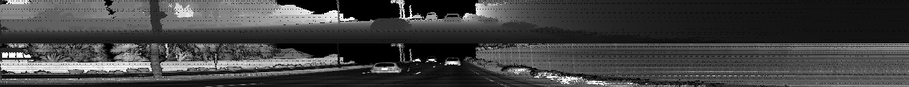
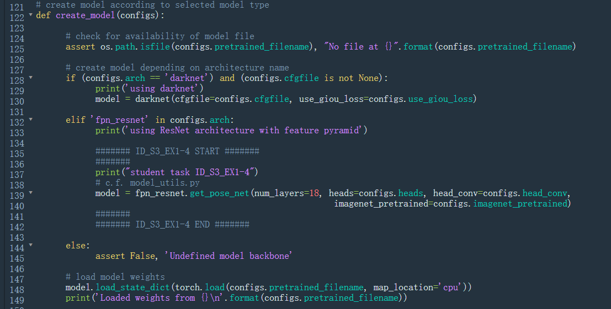
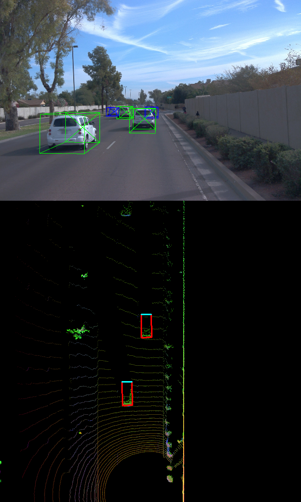
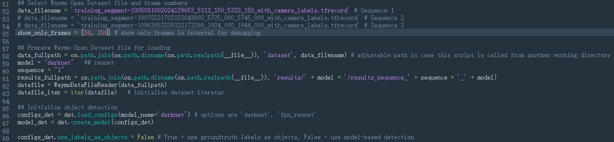
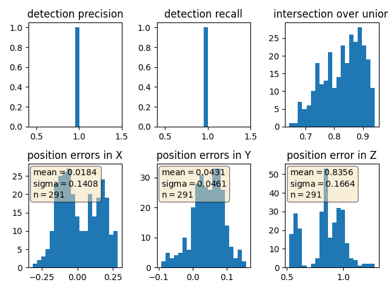

# Writeup: Track 3D-Objects Over Time

This is the project for the second course in the  [Udacity Self-Driving Car Engineer Nanodegree Program](https://www.udacity.com/course/c-plus-plus-nanodegree--nd213) : Sensor Fusion and Tracking. 

This mid-term project of the second course is finished within the online-workspace VM.

## Section 1: Compute Lidar Point-Cloud from Range Image

### part 1: Visualize range image channels (ID_S1_EX1)
First af all we are to previewing the range image and convert the floating-data in its two channels (i.e. range and intensity) to 8-bit integer value range, respectively. Specifically, the tasks are listed as follows:

- Convert range image “range” channel to 8bit
- Convert range image “intensity” channel to 8bit
- Crop range image to +/- 90 deg. left and right of the forward-facing x-axis
- Stack cropped range and intensity image vertically and visualize the result using OpenCV

To do these, the following changes have to be done in the `loop_over_dataset.py`

and also in `object_pcl.py`

As the results, we obtained:

It is worth to mention, the only the following figure fulfills the requirement of the projet, i.e.: crop range image to +/- 90 deg

By comparison, a similar result as the demonstation of the project is indeed a range image to +/- 180 deg. The details can be seen in 98. - 101. line of the function `show_range_image`

### part 2: Visualize point-cloud (ID_S1_EX2)
For the second part of ths section, we are to visualize the point-cloud, the changes have to be done in `loop_over_dataset.py` and `object_pcl.py`

With the above modifications, we obtained the PCL images:

The features such the cars, trucks can always be identified clearly. 

## Section 2: Create Birds-Eye View from Lidar PCL

In this section, we are to

- Convert coordinates in x,y [m] into x,y [pixel] based on width and height of the bev map
- Assign lidar intensity values to the cells of the bird-eye view map
- Adjust the intensity in such a way that objects of interest (e.g. vehicles) are clearly visible
- Make use of the sorted and pruned point-cloud lidar_pcl_top from the previous task
- Normalize the height in each BEV map pixel by the difference between max. and min. height
- Fill the "height" channel of the BEV map with data from the point-cloud

The changes are made in the `loop_over_dataset.py` and `object_pcl.py`

A result sample for the BEV:

To figure out the intensity image, the following modifications have to be finished:

To fill the "height" channel of the BEV map with data from the point-cloud, we changed the code and obtained the results:

## Section 3: Model-based Object Detection in BEV Image

In the third section, we introduced a third-party package into our code and extract features of interest. To be specific:

- In addition to Complex YOLO, extract the code for output decoding and post-processing from the [GitHub repo](https://github.com/maudzung/SFA3D).
- Transform BEV coordinates in [pixels] into vehicle coordinates in [m]
- Convert model output to expected bounding box format [class-id, x, y, z, h, w, l, yaw]

Correspondingly, the changes have to be made as follows:

Two result sampes can be obtained:

It is worth to mention that the first scene (the 50-frame), the result is the same as the demontration given in the instruction site, namely, only two of the vehicles haven been extracted, but at the second frame (the 51-frame) the vehicle farest from us can also be identified.

## Section 4: Performance Evaluation for Object Detection

In this section, the performance of the algorithms are evaluated by computing the corresponding IOU between the bounding boxes of labels and detected objects:
- Compute intersection-over-union (IOU) between labels and detections 
- Compute false-negatives and false-positives
- Compute precision and recall 

Correspondingly, the codes have to be modified as follows:

The histogram for the precision and recall can be plotted according to different cases:

